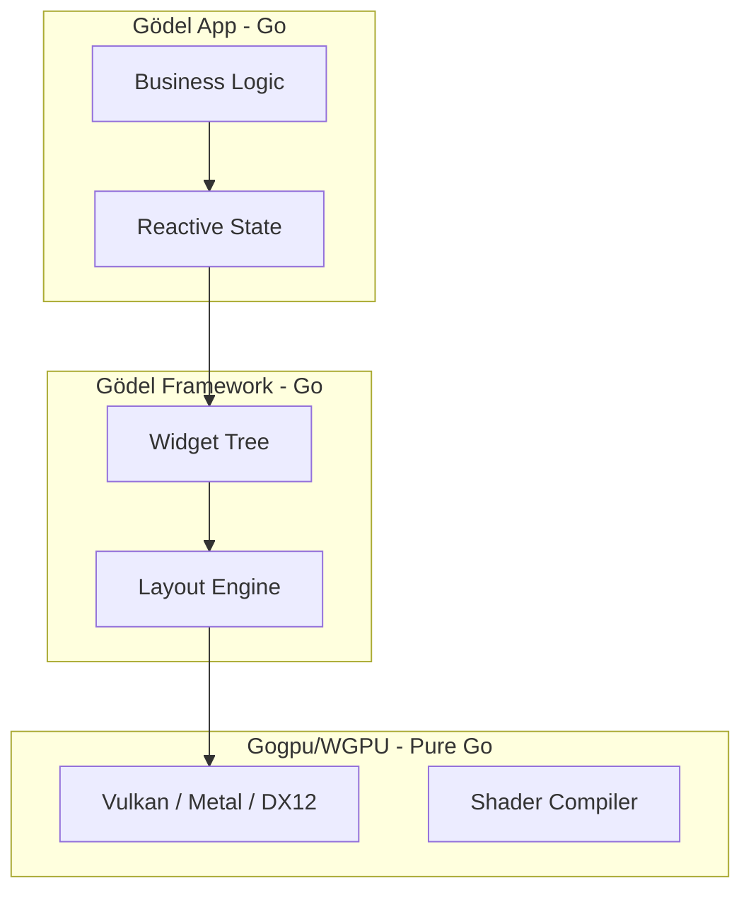

# Gödel: Performance & Architectural Evaluation

Gödel is designed for extreme efficiency by leveraging a **Zero-CGO, Pure-Go GPU Pipeline**. This document outlines how Gödel compares to industry standards like Flutter (Dart/C++) and Tauri (Rust/Webview).

## 📊 Performance Comparison (macOS)

| Metric | Gödel | Flutter | Tauri |
| :--- | :--- | :--- | :--- |
| **Bridge Overhead** | **None (Pure Go)** | High (C++/Dart Bridge) | Medium (Rust/JS IPC) |
| **GPU Pipeline** | **Pure Go (WGPU)** | Skia/Impeller (C++) | OS WebView (WKWebView) |
| **Idle CPU Usage** | **0.0%** | ~0.5% - 1.5% | ~1.0% - 2.0% |
| **Binary Size** | **~12MB** | ~35MB+ | ~10MB (JS base) |
| **Memory (RSS)** | **~25MB** | ~80MB+ | ~120MB+ |

## 🏗️ Architectural Advantage: Zero-CGO

In standard GPU frameworks (like Flutter), every frame requires crossing a "bridge" between the language (Dart) and the rendering engine (C++). Even in Go frameworks like Fyne, CGO is often required for windowing or OpenGL.

**Gödel eliminates this entirely.** 



### Why Zero-CGO Matters:
1.  **Lower Latency**: No context-switching penalty per frame.
2.  **Easier Tooling**: No need for complex C toolchains (LLVM/XCode) for standard dev.
3.  **Memory Safety**: Stay entirely within Go's garbage-collected, memory-safe bounds.
4.  **Instant Startup**: No heavy engine dynamic libraries to load on boot.

## 🚀 Benchmark Command

You can run a live performance evaluation on your current machine using the CLI:

```bash
godel report
```

To collect active GPU frame times:
```bash
godel bench examples/hello-world/main.go
```
